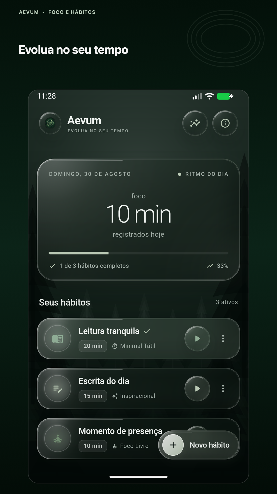
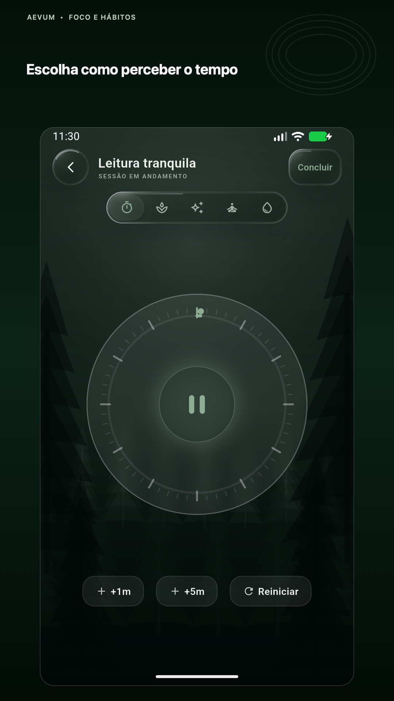
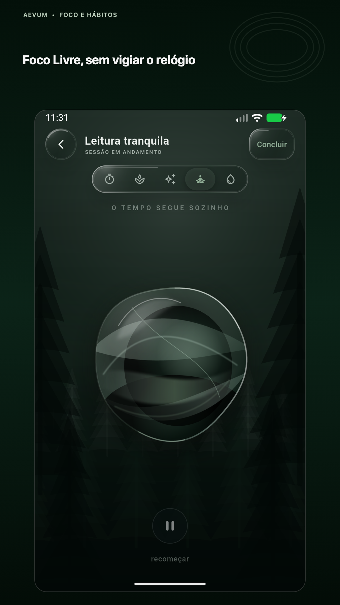
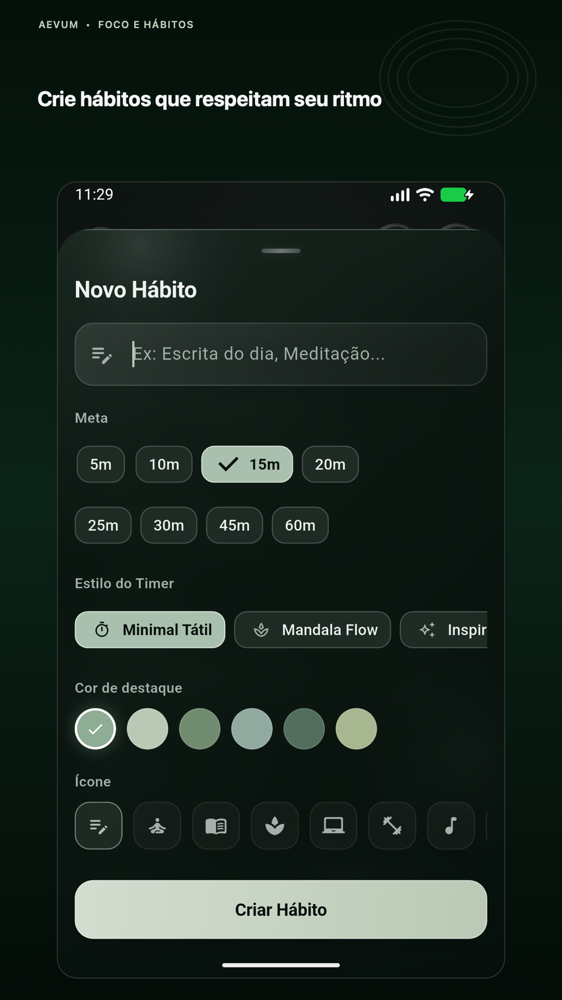
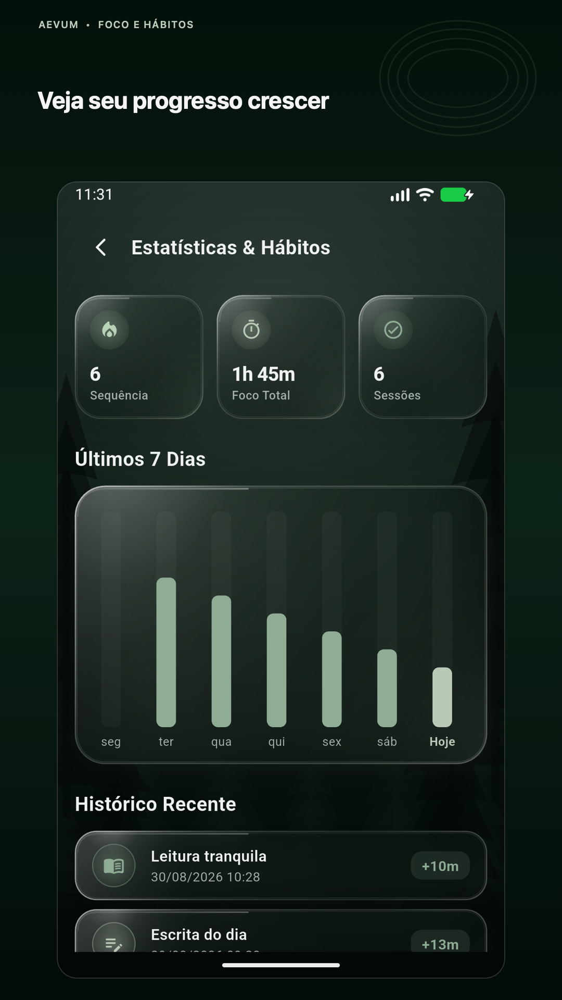
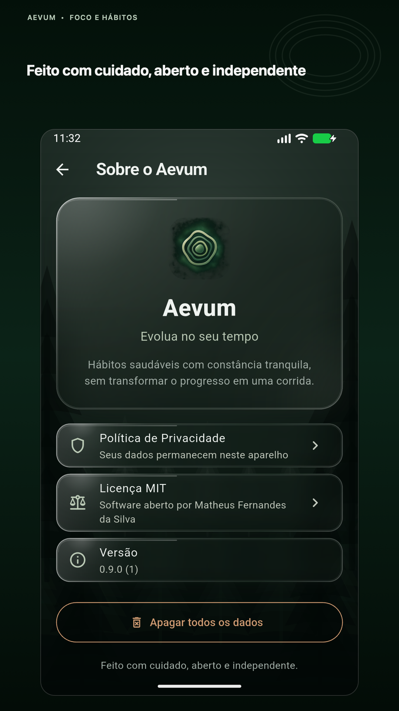

# Aevum

> Evolua no seu tempo.

Aevum é um app Android de hábitos e foco criado para quem quer avançar com
constância, sem transformar o cotidiano em uma corrida. Cada hábito pode usar
uma de cinco experiências visuais de tempo — do dial tátil ao Foco Livre, que
remove o relógio da tela.


## Princípios

- Progresso sem pressa ou pressão.
- Privacidade por padrão: tudo permanece no aparelho.
- Sem conta, anúncios, analytics ou coleta de dados.
- Design sereno, acessível e centrado no momento presente.

## Recursos

- Hábitos com duração, cor, ícone e modo visual próprios.
- Cinco modos: Minimal Tátil, Mandala Flow, Inspiracional, Foco Livre e Orbe
  Líquido.
- Histórico local, sequência, minutos acumulados e resumo dos últimos sete dias.
- Timer foreground-only: sair do app pausa a sessão de forma explícita.
- Som, vibração e confirmação dentro do app ao concluir.
- Onboarding, política de privacidade local e exclusão integral dos dados.

## Interface

<p align="center">
  
  
  
</p>

<p align="center">
  
  
  
</p>

## Privacidade

Hábitos, sessões e preferências são armazenados localmente com Hive e
SharedPreferences. O Aevum não transmite dados e não solicita permissão de
notificações. Leia a [política de privacidade](docs/privacy-policy.md).

## Desenvolvimento

Requisitos:

- Flutter 3.47.0
- Dart 3.13.0
- JDK 17
- Android SDK 36

```bash
flutter pub get
flutter analyze
flutter test
flutter run
```

Para gerar os pacotes de validação:

```bash
flutter build apk --debug
flutter build appbundle --release
```

Sem `android/key.properties`, o AAB release é apenas um artefato técnico não
assinado. Consulte [a configuração de assinatura](docs/android-signing.md).

## Arquitetura

O projeto usa Flutter, Riverpod e uma organização por funcionalidades:

- `lib/core`: tema, configuração, serviços e estado global.
- `lib/features/tasks`: hábitos, persistência e tela inicial.
- `lib/features/timer`: estado e cinco apresentações do temporizador.
- `lib/features/stats`: métricas locais e histórico.
- `lib/features/onboarding` e `lib/features/about`: introdução, transparência e
  controle de dados.

Valores persistidos usam chaves estáveis para ícones e modos visuais. Leituras
de versões antigas são migradas automaticamente.

## Links públicos opcionais

Contato, código-fonte, política online e apoio são configurados em build time e
ficam ocultos quando ausentes:

```bash
flutter run \
  --dart-define=AEVUM_PRIVACY_URL=https://exemplo.github.io/aevum/privacy-policy \
  --dart-define=AEVUM_SOURCE_URL=https://github.com/usuario/aevum \
  --dart-define=AEVUM_CONTACT_URL=mailto:contato@exemplo.com \
  --dart-define=AEVUM_SUPPORT_URL=https://buymeacoffee.com/usuario
```

A política local permanece disponível mesmo sem URL externa. Uma versão para
publicação na Google Play deve configurar a URL pública e o contato.

## Contribuindo

Abra uma issue descrevendo o problema ou proposta antes de mudanças grandes.
Pull requests devem manter `dart format`, `flutter analyze` e `flutter test`
passando e não podem introduzir analytics ou transmissão de dados sem uma
decisão pública e revisão da política de privacidade.

## Autor e licença

Criado por **Matheus Fernandes da Silva**. Distribuído sob a
[Licença MIT](LICENSE).
